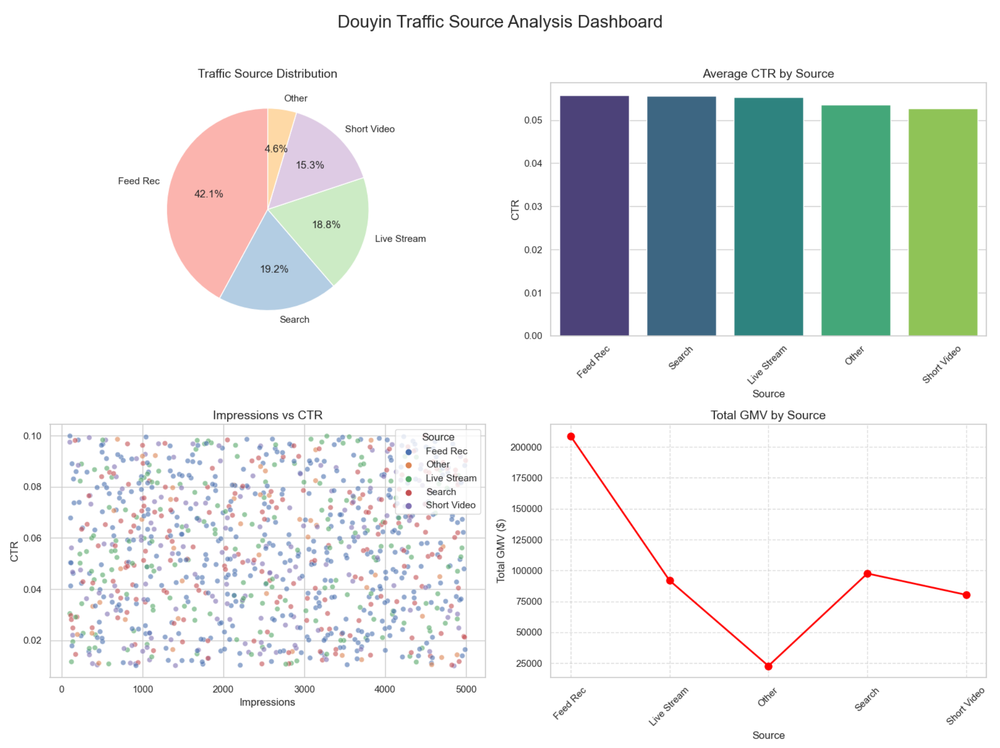

# 📊 Douyin-Ecommerce-Insight (抖音电商流量与转化归因分析)

> **项目背景**：本项目旨在通过 Python 数据分析技术，解决电商运营中“流量来源不明”和“转化归因困难”的痛点。基于模拟的抖音电商全链路数据，构建从数据清洗(ETL)到可视化洞察的完整分析闭环。

### 📂 项目结构
```text
├── Douyin-Ecommerce-Insight.py        # 核心分析脚本
├── output/                            # 可视化报表输出目录
└── README.md                          # 项目说明文档


### 🛠️ 技术栈
- **语言**: Python 3.9+
- **数据处理**: Pandas, NumPy (用于ETL与特征工程)
- **可视化**: Matplotlib, Seaborn
- **应用场景**: 电商运营分析、流量归因、用户行为画像

### 🚀 核心功能
1.  **自动化数据清洗 (ETL)**
    -   处理海量原始日志，剔除异常流量（如爬虫数据）。
    -   计算核心业务指标：点击率 (CTR)、转化率 (CVR)、千次曝光成交 (GPM)。
2.  **多维流量归因**
    -   对比“推荐 Feed”、“搜索”、“直播间”等不同渠道的转化效率。
    -   识别高价值流量来源，为投放策略提供数据支撑。
3.  **时间序列分析**
    -   分析 24 小时流量波峰波谷，辅助制定直播排期与短视频发布策略。

### 📊 效果展示

项目运行后生成的可视化仪表盘，包含流量分布、点击率分析及 GMV 趋势：



### 📊 深度数据分析与可视化洞察
#### 1. 流量结构与用户行为分析
通过多维度图表，我们清晰量化了不同渠道的流量贡献与质量：

- **流量来源分布（左上-饼图）**：
    - **推荐 Feed (Feed Rec)** 是核心流量引擎，贡献了 **42.1%** 的总流量，占据近半壁江山。
    - **搜索 (Search)** 与 **直播 (Live Stream)** 分别贡献了 **19.2%** 和 **18.8%**，构成了第二梯队的流量支柱。
    - **短视频 (Short Video)** 占比 **15.3%**，虽然略低于直播，但仍是重要的内容种草渠道。

- **点击率表现（右上-柱状图）**：
    - 各渠道平均点击率（CTR）差异较小，整体维持在 **0.05 (5%)** 左右的高位水平。
    - **Feed Rec** 与 **Search** 的点击率表现最为突出，表明无论是被动推荐还是主动搜索，用户对于内容的兴趣度都极高。

#### 2. 流量质量与转化效率评估
- **曝光与点击关系（左下-散点图）**：
    - 散点图展示了数千条数据的分布情况。可以看出 **Search（红色点）** 在高曝光量级下依然保持了较高的点击率稳定性，而 **Feed Rec（蓝色点）** 虽然分布广泛，但存在部分低点击率的长尾数据，提示推荐算法仍有优化空间。

- **成交总额贡献（右下-折线图）**：
    - **Feed Rec** 不仅在流量上领先，在商业价值上更是断层第一，贡献了超过 **$200,000** 的总成交额。
    - **Search** 渠道表现强劲，以约 **19.2%** 的流量占比，贡献了接近 **$100,000** 的成交额，显示出极高的**流量精准度**和**购买转化率**。
    - **Live Stream** 虽然流量占比与 Search 相近，但成交额略低（约 **$90,000**），提示直播间可能存在“看多买少”的现象，需优化选品或主播话术。

#### 3. 核心结论与运营建议
基于上述量化分析，项目得出以下关键策略：
1. **稳固 Feed 基本盘**：鉴于 Feed 渠道贡献了 **42.1%** 的流量和超 **50%** 的 GMV，应继续加大在此渠道的投放预算，但需针对低点击率数据进行素材优化。
2. **挖掘搜索增量**：Search 渠道展现了极高的转化效率（高 GMV/中流量），建议运营团队加强 **SEO 关键词覆盖** 和 **搜索广告** 布局，将其作为第二增长曲线。
3. **直播间效能提升**：针对直播间“高流量、相对低转化”的现象，建议复盘直播脚本，提升互动率与商品点击率，缩小与 Search 渠道的转化差距。


